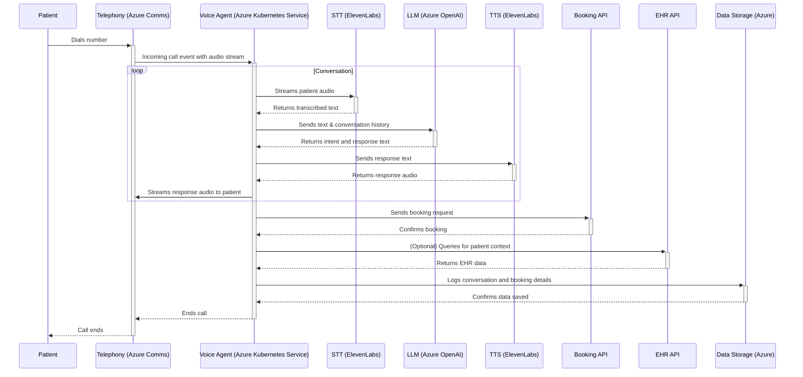

# Voice Agent Architecture Plan

This document outlines the architecture for a scalable, privacy-conscious, real-time Finnish-speaking voice agent for healthcare appointment booking.

## 1. System Overview & Call Flow

The architecture is designed as a set of microservices hosted on Microsoft Azure, ensuring scalability, reliability, and GDPR compliance. The system handles the entire lifecycle of a patient call, from the initial phone call to the final booking confirmation.

### Call Flow Diagram

## 2. Key Components & Responsibilities

### a. Telephony (Azure Communication Services)
- **Responsibility:** Manages PSTN (Public Switched Telephone Network) connectivity, handling incoming and outgoing calls. It provides the real-time audio stream to the Voice Agent.
- **Why Azure Communication Services?** As a native Azure service, it offers seamless integration, robust security (GDPR/HIPAA compliance), and scalability, fitting perfectly within the chosen cloud ecosystem.

### b. Voice Agent Service (Azure Kubernetes Service - AKS)
- **Responsibility:** The core of the system. This service, deployed on AKS, receives the real-time audio stream from the Telephony service. It orchestrates the entire call flow, managing the conversation state, streaming audio to STT services, handling responses from the LLM, and sending generated audio back to the user via the Telephony service.
- **Why AKS?** AKS provides managed Kubernetes, allowing for easy scaling of the voice agent containers to handle up to 100 concurrent calls and beyond. It also offers high availability and resilience.

### c. STT & TTS (ElevenLabs)
- **Responsibility:**
    - **Speech-to-Text (STT):** Transcribes the patient's Finnish speech into text in real-time.
    - **Text-to-Speech (TTS):** Converts the agent's text responses into natural-sounding Finnish speech.
- **Why ElevenLabs?** Chosen for its high-quality, low-latency Finnish language processing, which is crucial for a positive user experience.

### d. Agent powered by LLM (Azure OpenAI Service)
- **Responsibility:** Acts as the "brain" of the agent. It processes the transcribed text to understand patient intent, extracts relevant information (e.g., desired appointment time), and generates appropriate responses.
- **Why Azure OpenAI?** It provides access to powerful models like GPT-4 within the secure and compliant Azure environment, ensuring that sensitive data doesn't leave the trusted cloud infrastructure.

### e. External API Communication (Booking & EHR)
- **Responsibility:** The Voice Agent communicates with external REST APIs for booking appointments and retrieving EHR context. This interaction is managed within the agent's business logic. For a larger system, an API Gateway could be introduced to manage these external calls.

### f. Data Storage
- **Responsibility:** Securely storing conversation data, booking information, and call recordings.
- **Technology Choices:**
    - **Azure Cosmos DB:** A globally distributed, low-latency NoSQL database for storing structured data like conversation logs and booking details. All data will be stored in EU data centers.
    - **Azure Blob Storage:** For cost-effective storage of call recordings (with patient consent). Data is encrypted at rest and in transit.

### g. Caching (Azure Cache for Redis)
- **Responsibility:** Caching frequent LLM queries and responses to reduce latency and API costs. It stores key-value pairs of transcribed user utterances and the corresponding LLM-generated responses.
- **Why Azure Cache for Redis?** It is a fully managed, in-memory data store that provides the low latency needed for a real-time voice application. It helps to significantly speed up responses for common user inputs (e.g., "Hello", "I'd like to book an appointment").

### h. Monitoring (Azure Monitor)
- **Responsibility:** Provides comprehensive observability into the system. It collects logs, metrics, and traces from all components.
- **Why Azure Monitor?** It offers a unified solution for monitoring, alerting, and diagnostics, deeply integrated with AKS, Azure Communication Services, and other Azure resources.

## 3. Tech Stack Summary
- **Backend:** Python and C#/.NET (running in Docker containers on AKS)
- **Infrastructure:** Azure Kubernetes Service (AKS), Azure Networking
- **Voice Stack:** Azure Communication Services (Telephony), ElevenLabs (STT/TTS)
- **AI:** Azure OpenAI Service (LLM)
- **Databases:** Azure Cosmos DB, Azure Blob Storage, Azure Cache for Redis
- **Monitoring:** Azure Monitor, Application Insights, Log Analytics
- **DevOps:** GitHub Actions or Azure DevOps (CI/CD), Pulumi or Bicep (IaC)

## 4. DevOps & Automation

### a. Continuous Integration & Continuous Deployment (CI/CD)
- **Responsibility:** Automating the build, testing, and deployment of the Python and C# microservices.
- **Technology Choices:** The project can leverage either **GitHub Actions** or **Azure DevOps Pipelines** for CI/CD.

#### Option 1: GitHub Actions
- **Best for:** Teams already familiar with GitHub for source control and those who prefer a YAML-based, code-centric approach to CI/CD.
- **Workflow:**
    - **On Pull Request:** The pipeline will trigger automatically to run static analysis, unit tests, and integration tests for both the Python and C# codebases.
    - **On Merge to `main`:** After a successful pull request, the pipeline will build and push Docker images for each service to **Azure Container Registry (ACR)**. It will then trigger a deployment to the **Azure Kubernetes Service (AKS)** cluster, ensuring a seamless and automated release process.

#### Option 2: Azure DevOps Pipelines
- **Best for:** Teams deeply integrated with the Microsoft ecosystem, preferring a comprehensive suite of DevOps tools, and seeking native Azure integrations.
- **Workflow:**
    - Azure Pipelines offer both YAML and classic UI-based pipeline definitions.
    - It provides robust features for managing build agents, artifact feeds, and release gates, with deep integration into Azure services for streamlined deployments to AKS.

### b. Infrastructure as Code (IaC)
- **Responsibility:** Defining and managing all Azure cloud resources in a declarative and version-controlled manner.
- **Technology Choices:** The project can leverage either **Pulumi** or **Bicep**, depending on team preference and skillset.

#### Option 1: Pulumi (Developer-Centric Approach)
- **Best for:** Teams that want to use general-purpose programming languages (like Python and C#) to manage infrastructure, applying software engineering best practices like unit testing and creating reusable components.
- **Workflow:**
    - The infrastructure for the Python services can be defined in Python, and the C# services' infrastructure can be defined in C#.
    - This empowers developers to own their infrastructure code in a language they are already familiar with.
    - The Pulumi state can be managed by the Pulumi Service or a self-hosted backend like Azure Blob Storage.

#### Option 2: Bicep (Azure-Native Approach)
- **Best for:** Teams that are exclusively focused on Azure and prefer a simple, declarative DSL that guarantees immediate support for all new Azure features.
- **Workflow:**
    - Bicep files provide a clean and readable way to define all Azure resources.
    - As a Microsoft-native tool, it offers seamless integration with Azure CLI and Azure DevOps/GitHub Actions.
    - This approach is excellent for its simplicity and direct mapping to Azure Resource Manager (ARM) templates.

## 5. Security & GDPR Compliance
- **Data Residency:** All data is stored within EU data centers, satisfying GDPR requirements.
- **Data Encryption:** Data is encrypted both in transit (using TLS) and at rest (using Azure's default storage encryption).
- **PII Handling:** The system is designed to handle Personally Identifiable Information (PII) securely. Access to sensitive data is restricted, and the LLM is accessed through the compliant Azure OpenAI service.
- **Consent:** For features like call recording, explicit consent will be obtained from the user at the beginning of the call.
